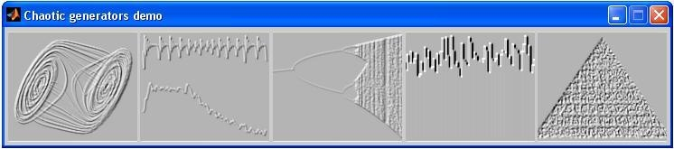

# Chaotic Generator Demo Software written in MATLAB

This demo is written in [MATLAB](https://www.mathworks.com) and represents the work done for my final year project for obtaining my BSc Degree in Telecommunications. 

The main window (figure 1) is called by typing at the Matlab prompt ”start”.

From the main window five different tools can be called:

- 2D attractor
- time and frequency domain
- bifurcation diagram
- histogram
- bicoherence

From each tool the chaotic generators can be selected and their behavior studied. The chaotic generators are grouped into two classes:

- time discrete
- time continuous

Some tools can be used for both classes of chaotic generators, others can be used only for one class.

Other chaotic generators can be easily added to the existing ones by creating a script file in the directory corresponding to its class: ”Cont” or ”Discr”. In this case no default parameters are available and they must be typed manually in the edit boxes of each tool.
